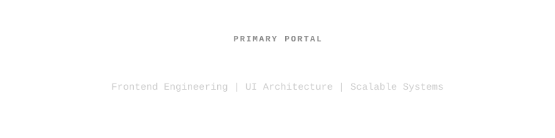
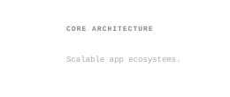
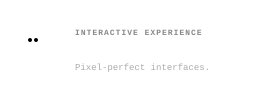
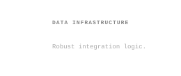
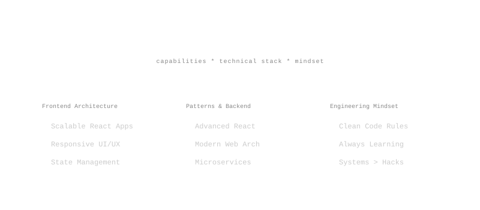

  

  

 

  <samp>
    Systems Engineering student focused on frontend development, scalable web applications, and modern UI architecture. 
    Currently building projects with React, Node.js, and Supabase.
  </samp>

<!-- Title -->

  

  

<h2 align="center">Technologies</h2>

<table align="center" cellspacing="0" cellpadding="6">
  <tr>
    <td align="center"></td>
    <td align="center"></td>
    <td align="center"></td>
    <td align="center"></td>
    <td align="center"></td>
  </tr>
  <tr>
    <td align="center"></td>
    <td align="center"></td>
    <td align="center"></td>
    <td align="center"></td>
    <td align="center"></td>
  </tr>
</table>

<h2 align="center">Activity</h2>

  

  

  
    

<h2 align="center">Collaboration & Contact</h2>

 

  <samp>
    I'm always open to discussing new projects, creative ideas or opportunities to be part of your visions. 
    Currently focusing on <b>Frontend Web Applications</b>, <b>Clean Code Architecture</b>, and <b>React/Next.js</b>.
  </samp>

 

  
  &nbsp;&nbsp;&nbsp;
  
  &nbsp;&nbsp;&nbsp;
  

<samp>Passionate about frontend architecture and scalable applications</samp>

  

